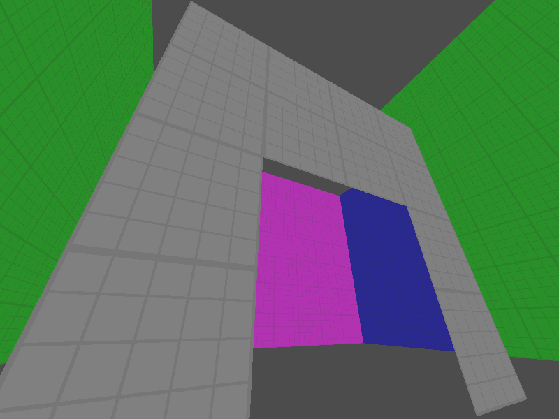
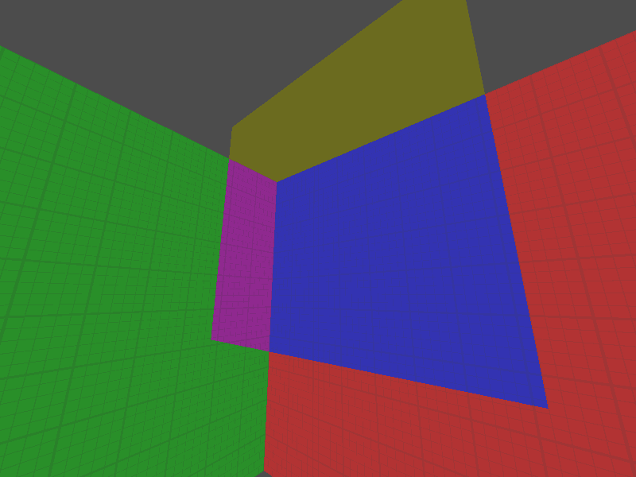

# completely normal maze game

this is a completely normal maze game.

we have a completely normal voxel-based maze, which has normal things like a player and walls and multiple rooms and definitely not things like seamless portals enabling impossible geometry. definitely not.

But for real now.

This is a game with the goal of letting the player explore liminal spaces in non-Euclidean geometry. You try to solve puzzles in a world silently different from our own. <!-- The game uses voxel-based engine and GPU shaders to create the world. -->

## Gallery

<p align="center">
	
	<br>
	<em>A simple portal creating the effect of a <s>larger</s> normal-on-the-inside-room</em>
	<br>
	<br>
	
	<br>
	<em>one of the first portals i made when testing the generation code. i was surprised when just a single line in the shader made it work!</em>
</p>

## Features

- Face-based voxel data
- 3D DDA on said voxels on the GPU
- Procedural room builder
- Oklab based color pipeline
- Portals!

## Roadmap

- [ ] Arbitrary space transformation
- [ ] Collision detection
- [ ] Dynamic entities
- [ ] Portal traversal for entities
- [ ] Level editor mode

## Installation

The project uses [`uv`](https://docs.astral.sh/uv/) for package management.

If you don't have it installed, follow the official installation guide:
https://docs.astral.sh/uv/getting-started/installation/

Then, run the following code in your preferred parent directory.

```bash
git clone https://github.com/ThatShushi17/normal-maze
cd normal-maze

uv sync

# to run the game
uv run main.py
```

If you don't want to use `uv`, you will need to install the dependencies listed in `pyproject.toml` and make sure your version of python is up to date. Python 3.13.12 was the version tested, and other versions may break certain dependencies.

## License

This project is licensed under the GNU Affero General Public License v3.0 (AGPLv3).